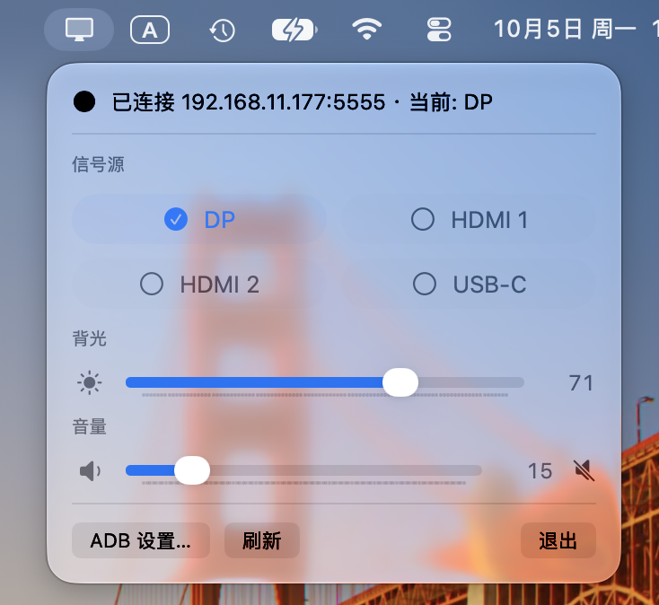

# MonitorSwitch — Redmi 显示器 G Pro 27U 的 macOS 菜单栏控制工具



> A lightweight macOS menu bar app for the **Redmi G Pro 27U smart monitor** (2025 & 2026): switch input sources, adjust backlight and volume over wireless ADB — nothing needs to be installed on the monitor.

在 Mac 菜单栏上一键切换 Redmi G Pro 27U 智能显示器的**信号源**（DP / HDMI 1 / HDMI 2 / USB-C）、调节**背光**和**音量**。显示器端无需安装任何应用，走无线 ADB。

## 兼容性

| 机型 | 状态 |
|---|---|
| Redmi G Pro 27U **2025 款**（XMI27B3 / MiTV-MFFU1，出厂 HyperOS 2） | ✅ 已实测（开发与日常使用机） |
| Redmi G Pro 27U **2026 款**（XMI3009，出厂 HyperOS 3） | 🔶 理论可用（命令集提取自 [Mimonitor_Toolbox](https://github.com/YiHoooong/Mimonitor_Toolbox)，其在 2026 款 + HyperOS 3.0.112.0 上验证通过） |

**两款理论上都可以使用**：核心通道是小米电视系通用的（`EXTSRC_PLAY` 信号源意图、`settings` 键值、MTK 寄存器）。如果你在 2026 款上使用遇到差异，欢迎提 issue 反馈。

## 功能

- 🖥 菜单栏面板一键切换信号源：DP / HDMI 1 / HDMI 2 / USB-C，当前源实时打勾
- 🔆 背光拖动条（1–100）——寄存器直写 `g_disp__disp_back_light` + `PIC_MODE_CHANGED` 广播刷新 + settings 记账，松手即时生效（与 Mimonitor_Toolbox 同款三步）
- 🔊 音量拖动条（0–100）+ 静音按钮——**一步到位**：自研 `VolDirectTool` 经 TvService 以 system 身份直调 `AudioManager.setStreamVolume`（与小爱同学同一条生效路径），瞬时生效；异常时自动回退 keyevent 步进
- ● 连接状态轮询（10s）+ 自动重连，掉线图标变划线显示器
- 首次连接自动向显示器部署内嵌的 `MtkDirectTool.jar`（5KB，MIT）并读寄存器校准真实背光
- 首次运行设置设备地址，存 `UserDefaults`，代码不写死任何地址

## 要求

- macOS 13+
- 本机装有 adb（`brew install android-platform-tools`，或 Android SDK platform-tools）

## 构建与安装

```bash
./build.sh          # 产出 build/MonitorSwitch.app（ad-hoc 签名，本机自用）
./install.sh        # 构建并安装到 /Applications，然后启动
```

## 使用

1. 显示器上开启「网络 ADB 调试」（设置 → 账号与安全 → ADB 调试），Mac 与显示器同一局域网
2. 首次启动会弹出 ADB 设置面板，填入显示器的 ADB 地址（如 `192.168.1.100:5555`，端口可省略）
3. 首次连接时显示器会弹出授权对话框，用遥控器选「始终允许」

## 原理与致谢

切源命令与信号源 ID 映射提取自 [YiHoooong/Mimonitor_Toolbox](https://github.com/YiHoooong/Mimonitor_Toolbox)（MIT License），寄存器读写内嵌其 `MtkDirectTool.jar`：

```
# 切信号源（ID: 23=HDMI1  24=HDMI2  29=DP  30=USB-C）
am start -a com.xiaomi.mitv.tvplayer.EXTSRC_PLAY \
  -n com.xiaomi.mitv.tvplayer/.ExternalSourceActivity --ei input <ID> -f 0x10000000

# 当前源读取
settings get global mitv.tvplayer.hdmi.last.source
# 背光三步：寄存器直写 → 广播刷新 → settings 记账
#   MtkDirectTool set g_disp__disp_back_light <N>
#   am broadcast -a com.xiaomi.mitv.action.PIC_MODE_CHANGED --ei picmode 7
#   settings put global picture_backlight / xiaomi_picture_backlight <N>
```

注意：这台固件上存在「写账不动物件」的坑——`media_session --set` 返回成功但**不会真正改音量**（假成功；shell 直写通道被阉，连借 system uid 走 `cmd` 也会因 AppOps 包归属校验抛异常）；背光只写 `settings put` 也**不会改变实际亮度**，必须走寄存器直写。本项目已替你踩过这些坑。

音量的解法是自研 [`VolDirectTool`](Assets/VolDirectTool.java)（约 60 行，源码随仓库）：经 TvService 的 `app_process` 以 system 身份运行，`Looper.prepareMainLooper()` + `ActivityThread.systemMain()` 拿到 system context 后直调 `AudioManager.setStreamVolume`——这正是小爱同学设音量的同一条路，一次调用瞬时生效。构建它只需 `javac` + Google Maven 的 r8.jar（d8），无需 Android SDK。

## 许可

[MIT](LICENSE)。内嵌的 `MtkDirectTool.jar` 来自 [Mimonitor_Toolbox](https://github.com/YiHoooong/Mimonitor_Toolbox)（MIT）。
